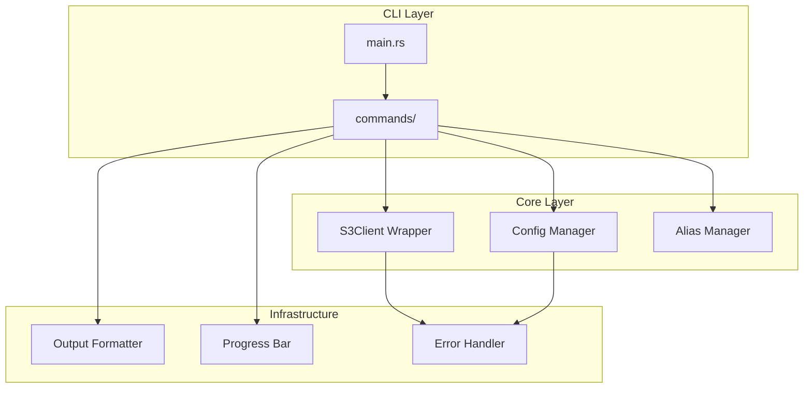

# rc - Rust S3 CLI Client 开发计划

## 项目概述

`rc` 是一个用 Rust 编写的 S3 兼容命令行客户端，灵感来自 [minio/mc](https://github.com/minio/mc)。使用 `aws-sdk-s3` 作为底层 SDK，支持所有 S3 兼容的对象存储服务。

## 架构设计




## 目录结构

```javascript
rc/
├── src/
│   ├── main.rs                 # 入口点
│   ├── lib.rs                  # 库导出
│   ├── cli/
│   │   ├── mod.rs              # CLI 定义
│   │   └── args.rs             # 参数解析
│   ├── commands/               # 命令实现
│   │   ├── mod.rs
│   │   ├── alias.rs            # alias 管理
│   │   ├── ls.rs               # 列出对象
│   │   ├── cp.rs               # 复制对象
│   │   ├── rm.rs               # 删除对象
│   │   ├── mb.rs               # 创建桶
│   │   ├── rb.rs               # 删除桶
│   │   ├── cat.rs              # 输出内容
│   │   ├── head.rs             # 显示头部
│   │   ├── stat.rs             # 对象状态
│   │   ├── mv.rs               # 移动对象
│   │   ├── mirror.rs           # 镜像同步
│   │   ├── diff.rs             # 差异比较
│   │   ├── find.rs             # 查找对象
│   │   ├── tree.rs             # 树形显示
│   │   ├── pipe.rs             # 管道输入
│   │   ├── share.rs            # 生成分享链接
│   │   ├── watch.rs            # 监听事件
│   │   ├── sql.rs              # S3 Select
│   │   ├── version.rs          # 版本管理
│   │   ├── retention.rs        # 保留策略
│   │   └── tag.rs              # 标签管理
│   ├── core/
│   │   ├── mod.rs
│   │   ├── client.rs           # S3 客户端封装
│   │   ├── config.rs           # 配置管理
│   │   ├── alias.rs            # Alias 存储
│   │   └── path.rs             # 路径解析 (alias/bucket/key)
│   ├── output/
│   │   ├── mod.rs
│   │   ├── formatter.rs        # 输出格式化
│   │   ├── progress.rs         # 进度条
│   │   └── table.rs            # 表格输出
│   └── error.rs                # 错误定义
├── tests/
│   ├── integration/            # 集成测试
│   └── fixtures/               # 测试数据
├── .github/
│   └── workflows/
│       ├── ci.yml              # CI 流水线
│       └── release.yml         # 发布流水线
├── Cargo.toml
├── Cargo.lock
├── README.md
├── IMPLEMENTATION_PLAN.md      # 实施计划跟踪
└── .cursorrules                # AI 开发规范
```


## 核心依赖

| Crate | 用途 ||-------|------|| aws-sdk-s3 | S3 操作 || aws-config | AWS 配置 || clap | CLI 参数解析 || tokio | 异步运行时 || toml | 配置文件 || serde | 序列化 || indicatif | 进度条 || comfy-table | 表格输出 || thiserror | 错误处理 || tracing | 日志追踪 || dirs | 配置目录 |---

## 分阶段实施计划

### 阶段 1: 项目基础架构 (Foundation)

**目标**: 建立可编译、可测试的项目骨架**交付物**:

- 项目结构和 Cargo.toml
- 错误处理框架
- 配置管理 (TOML)
- Alias 管理系统
- S3 客户端封装
- 路径解析器 (alias/bucket/key)
- 基础 CLI 框架 (clap)
- GitHub Actions CI 配置

**成功标准**:

- `cargo build` 成功
- `cargo test` 通过
- `cargo fmt --check` 无警告
- `cargo clippy` 无警告
- CI 流水线绿色

**验收测试**:

```bash
rc alias set minio http://localhost:9000 minioadmin minioadmin
rc alias list
rc alias remove minio
```

---

### 阶段 2: 基础命令 (Basic Commands)

**目标**: 实现最常用的基础操作命令**交付物**:

- `ls` - 列出桶/对象
- `mb` - 创建桶
- `rb` - 删除桶
- `cat` - 输出对象内容
- `head` - 显示对象头部 N 行
- `stat` - 显示对象元数据
- 输出格式化 (human-readable, JSON)
- 进度条显示

**成功标准**:

- 所有命令单元测试通过
- 集成测试通过 (使用 MinIO 容器)
- 错误信息清晰友好

**验收测试**:

```bash
rc mb minio/test-bucket
rc ls minio/
rc ls minio/test-bucket
rc stat minio/test-bucket/file.txt
rc cat minio/test-bucket/file.txt
rc head -n 10 minio/test-bucket/file.txt
rc rb minio/test-bucket
```

---

### 阶段 3: 传输命令 (Transfer Commands)

**目标**: 实现对象传输相关命令**交付物**:

- `cp` - 复制对象 (本地到S3, S3到本地, S3到S3)
- `mv` - 移动对象
- `rm` - 删除对象
- `pipe` - 从标准输入上传
- 递归操作支持 (-r)
- 并发传输
- 断点续传 (大文件分片)

**成功标准**:

- 大文件传输稳定 (>5GB)
- 并发传输性能符合预期
- 错误重试机制工作正常

**验收测试**:

```bash
rc cp ./local-file.txt minio/bucket/
rc cp minio/bucket/file.txt ./download/
rc cp -r ./local-dir/ minio/bucket/dir/
rc mv minio/bucket/old.txt minio/bucket/new.txt
rc rm minio/bucket/file.txt
rc rm -r minio/bucket/dir/
echo "hello" | rc pipe minio/bucket/hello.txt
```

---

### 阶段 4: 高级命令 (Advanced Commands)

**目标**: 实现高级操作命令**交付物**:

- `find` - 查找对象 (支持过滤条件)
- `diff` - 比较两个位置的差异
- `mirror` - 镜像同步
- `tree` - 树形显示结构
- `share` - 生成预签名 URL

**成功标准**:

- find 支持 name/size/time 过滤
- mirror 支持增量同步
- 所有命令测试通过

**验收测试**:

```bash
rc find minio/bucket --name "*.txt" --newer-than 1d
rc diff minio/bucket1 minio/bucket2
rc mirror minio/source minio/target
rc tree minio/bucket
rc share download minio/bucket/file.txt --expire 24h
```

---

### 阶段 5: 管理命令 (Management Commands)

**目标**: 实现桶和对象管理命令**交付物**:

- `version` - 版本控制管理
- `retention` - 保留策略
- `tag` - 标签管理
- `watch` - 事件监听
- `sql` - S3 Select 查询

**成功标准**:

- 所有管理命令正常工作
- 事件监听实时性好
- SQL 查询支持 CSV/JSON/Parquet

**验收测试**:

```bash
rc version enable minio/bucket
rc version list minio/bucket/file.txt
rc retention set --mode governance --validity 30d minio/bucket/file.txt
rc tag set minio/bucket/file.txt "env=prod&team=dev"
rc tag list minio/bucket/file.txt
rc watch minio/bucket
rc sql --query "SELECT * FROM s3object WHERE age > 20" minio/bucket/data.csv
```

---

### 阶段 6: 发布准备 (Release)

**目标**: 完成发布准备工作**交付物**:

- Release GitHub Action (多平台构建)
- 完整的 README 文档
- CHANGELOG
- Shell 自动补全脚本
- Homebrew formula (可选)
- 性能优化和最终测试

**成功标准**:

- 多平台二进制可用 (Linux/macOS/Windows)
- 文档完整清晰
- 所有测试通过

---

## 验收标准

### 代码规范

1. **格式化**: 必须通过 `cargo fmt --all --check`
2. **Lint**: 必须通过 `cargo clippy -- -D warnings`
3. **测试**: 必须通过 `cargo test`
4. **文档**: 公开 API 必须有文档注释

### 提交规范

```javascript
<type>(<scope>): <subject>

<body>

<footer>
```

类型: feat, fix, docs, style, refactor, test, chore

### 测试覆盖

- 单元测试覆盖核心逻辑
- 集成测试覆盖命令行为
- 使用 MinIO 容器进行端到端测试

---

## AI 开发规范 (AGENTS.md)

将创建 AGENTS.md 文件，包含：

1. **阶段感知**: AI 必须先读取 `IMPLEMENTATION_PLAN.md` 确认当前阶段
2. **代码风格**: 遵循 Rust 惯用风格，使用 `thiserror` 处理错误
3. **测试优先**: 新功能必须先写测试
4. **增量提交**: 每个小功能点独立提交
5. **文档要求**: 复杂逻辑必须注释
6. **禁止行为**: 不允许 `unwrap()` (除测试), 不允许 `unsafe`

---

## 初始文件清单

执行计划后将创建以下文件：

1. `Cargo.toml` - 项目配置
2. `src/main.rs` - 入口点
3. `src/lib.rs` - 库导出
4. `src/error.rs` - 错误定义
5. `src/cli/mod.rs` - CLI 模块
6. `src/cli/args.rs` - 参数定义
7. `src/core/mod.rs` - 核心模块
8. `src/core/config.rs` - 配置管理
9. `src/core/alias.rs` - Alias 管理
10. `src/core/client.rs` - S3 客户端
11. `src/core/path.rs` - 路径解析
12. `src/commands/mod.rs` - 命令模块
13. `src/commands/alias.rs` - alias 命令
14. `src/output/mod.rs` - 输出模块
15. `.github/workflows/ci.yml` - CI 配置
16. `.github/workflows/release.yml` - 发布配置
17. `IMPLEMENTATION_PLAN.md` - 实施跟踪
18. `.cursorrules` - AI 开发规范
19. `README.md` - 项目说明

---

## 风险与缓解

| 风险 | 缓解措施 ||------|----------|| aws-sdk-s3 API 变化 | 锁定版本，关注 changelog || 大文件传输内存问题 | 使用流式传输，分片上传 |